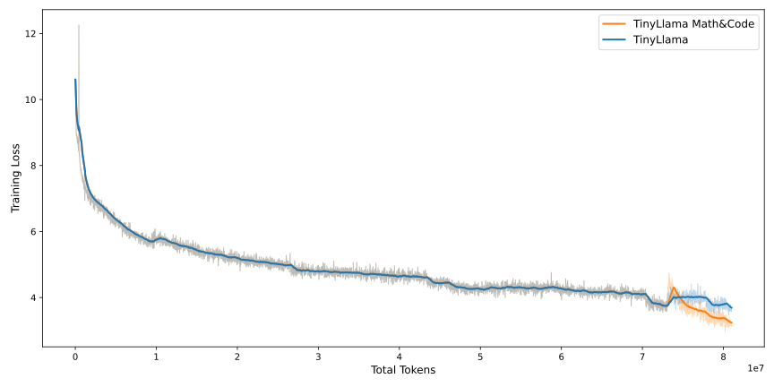
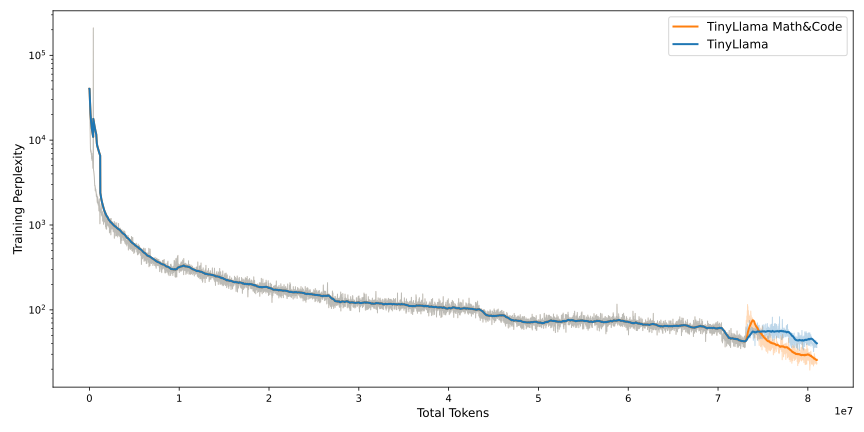
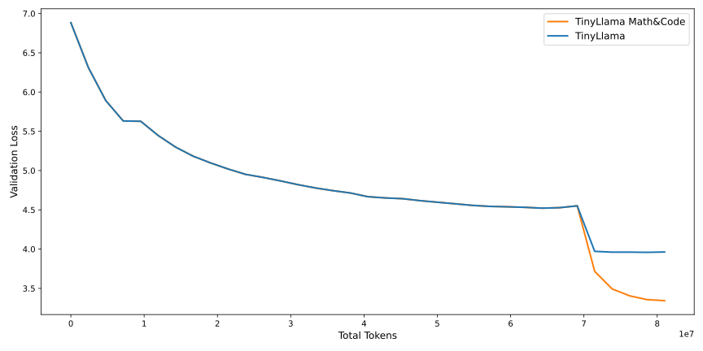
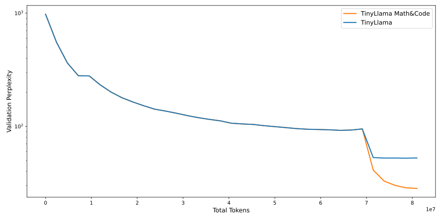

# TinyLLaMA

This repository is an **unofficial implementation** of TinyLLaMA. For the official implementation, visit the [TinyLLaMA GitHub Repository](https://github.com/jzhang38/TinyLlama).

---

## Table of Contents

- [Installation](#installation)
- [Download Data](#download-data)
  - [Pre-training](#pre-training-data)
  - [Inference](#inference-data)
- [Pre-training](#pre-training)
- [Inference](#inference)
- [Training Losses](#training-losses)
- [Example Outputs](#example-outputs)

---

## Installation

Ensure that all required dependencies are installed by running:

```bash
pip install -r requirements.txt
```


---
## Environment variables

You have to set the following environment variables in your `.env` file:

```
HF_TOKEN=your Hugging Face token
```
---

## Download Data

### Pre-training Data

For pre-training, the data is downloaded automatically. The following datasets are used and pre-configured:

- `paulo037/starcoder`
- `paulo037/slimpajama`

No manual download is required.

### Inference Data

For inference, you need to download a model checkpoint from Hugging Face. Available checkpoints are in the following repositories:

- [`paulo037/tinyllama_slimpajama`](https://huggingface.co/paulo037/tinyllama_slimpajama)
- [`paulo037/tinyllama_math_and_code`](https://huggingface.co/paulo037/tinyllama_math_and_code)
- [`paulo037/tinyllama_math_and_code_cooldown`](https://huggingface.co/paulo037/tinyllama_math_and_code_cooldown)
- [`paulo037/tinyllama_slimpajama_1_1`](https://huggingface.co/paulo037/tinyllama_slimpajama_1_1)
- [`paulo037/tinyllama_slimpajama_1_1_cooldown`](https://huggingface.co/paulo037/tinyllama_slimpajama_1_1_cooldown)

---

## Pre-training

Below are example commands for pre-training the TinyLLaMA Math&Code model.

### Basic pre-training

```bash
python3 -m pre-train.train --model=tiny_LLaMA_1b \
                           --huggingface_repo_id=paulo037/tinyllama_slimpajama
```

### Continual pre-training with specific domain

```bash
python3 -m pre-train.train --model=tiny_LLaMA_1b \
                           --load_weights=checkpoints/checkpoint_step_4638.pt \
                           --huggingface_repo_id=paulo037/tinyllama_math_and_code \
                           --dataset_id=paulo037/starcoder \
                           --warmup_dataset_id=paulo037/slimpajama \
                           --warmup_steps=40 \
                           --learning_rate=4e-7 \
                           --min_lr=1e-7 \
                           --max_epochs=2
```

### Cooldown
```bash
python3 -m pre-train.train --model=tiny_LLaMA_1b \
                           --load_weights=checkpoints/checkpoint_step_618.pt \
                           --huggingface_repo_id=paulo037/tinyllama_math_and_code_cooldown \
                           --dataset_id=paulo037/starcoder \
                           --warmup_steps=20 \
                           --learning_rate=1e-7 \
                           --min_lr=1e-7 \
                           --max_epochs=1 \
                           --gradient_accumulation_steps=64 \
                           --validation_steps=40
```

### View All Parameters

To view a full list of training options, run:

```bash
python3 -m tinyllama.generate --help
```

---

## Inference

To generate text using a trained checkpoint, use the following command:

```bash
python3 -m tinyllama.generate --input_text="Once Upon a time" \
                              --checkpoint="checkpoints/checkpoint_step_77.pt" \
                              --max_length=30
```

### View Inference Parameters

For more information on the available options, run:

```bash
python3 -m tinyllama.generate --help
```

---

## Example Outputs

```plaintext
Input: "Once Upon a time"
Output: "Once Upon a time, I submitted a search of my business patrol service and found out that I watched one of our companies. If you need to exchange a business physician to perform a crucial deal, then you may be looking to get it."
```

```plaintext
Input: ""
Output:""""
from magimlin.Cas.pk py.stimatype import StVersionPack
import os??? as _RB

def sProcess(data):
    return r

def shmode(mock):
    return (version):
    if isinstance(value):
        return _Time(options.obs())

    return len(key)
""""
```


---

## Training Losses

Training metrics such as loss and perplexity are logged and saved as charts:

- **Training Loss**:

  
- **Training Perplexity**:

  
- **Validation Loss**:

  
- **Validation Perplexity**:

  

---

## License

This project is **unofficial** and provided "as is." For the original TinyLLaMA implementation, check the [official repository](https://github.com/jzhang38/TinyLlama).

---

Happy Training! 🚀
